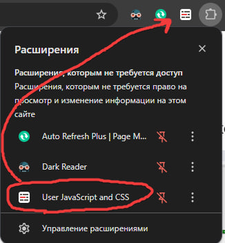
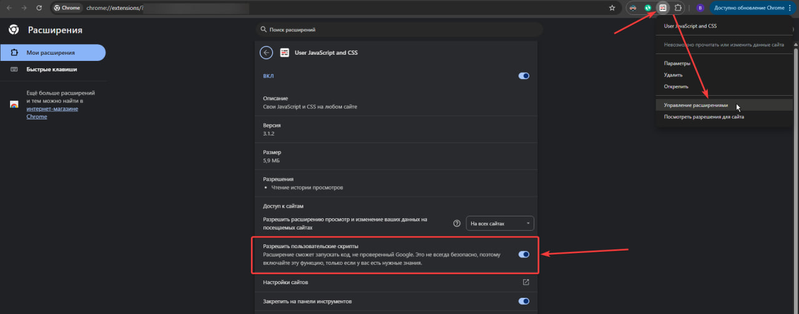
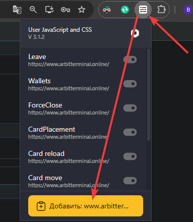
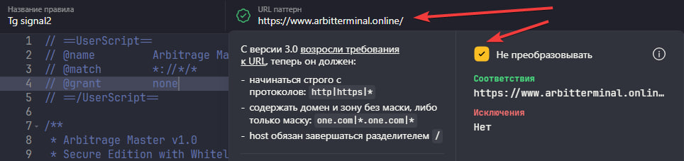
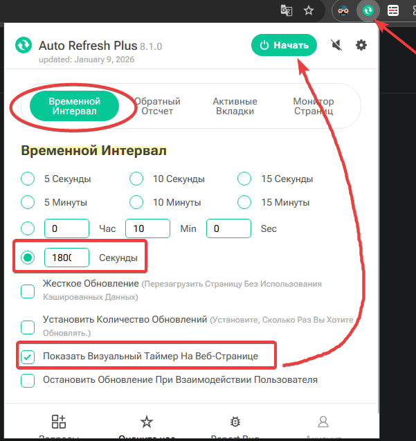

# 🛰️ ArbiHunter-System: Private Terminal Tools (v1.9.1)

**Розширений набір інструментів для учасників команди Spread Hunters.**

Ласкаво просимо до закритого інструментарію. Цей набір скриптів створений для того, щоб зробити нашу спільну роботу в терміналі швидшою, ефективнішою та прозорішою.

> [!IMPORTANT]
> **Це приватне програмне забезпечення.** Доступ, на даний момент, надається виключно діючим учасникам команди **Spread Hunters**. Передача скриптів третім особам суворо заборонена.

---

## ✨ Основний функціонал

Система складається з двох взаємопов'язаних модулів, які автоматизують рутинні процеси та покращують комунікацію в команді.

| Модуль | Опис | Ключові можливості |
| :--- | :--- | :--- |
| **🛰️ Arbitrage Tracker** | Автоматичний моніторинг | Фіксація обсягів, статус "Online", синхронізація з Telegram-чатом команди, Auto-Zero захист, тест з'єднання, статистика команди, редагування нікнейма, drag-and-drop інтерфейс, smooth анімації. |
| **✈️ Card Sharer** | Швидкий обмін даними | Створення чистих скриншотів, вибір цільових гілок (Чат/Сигнали/Тести), швидкі коментарі. |

---

## 🆕 Новинки v1.9

### 🎨 Революційний UI/UX Редизайн
- **Google Fonts інтеграція** — використання Orbitron та Inter шрифтів для більш сучасного вигляду
- **Покращена glass-morphism** — новий ефект `saturate(220%)` для ще більш елегантного вигляду
- **Більші округлі кути** — 28px border-radius замість 16px для м'якшого дизайну
- **Глибокі тіні** — inset shadows для кращої глибини та об'ємності

### 🖱️ Drag-and-Drop Функціональність
- **Перетягування віджету** — тепер ви можете перемістити панель моніторингу в будь-яке місце екрану
- **Збереження позиції** — ваша улюблена позиція віджету зберігається в localStorage
- **Інтуїтивне управління** — тягніть за header або rocket button 🚀

### ⚙️ Редагування Нікнейма "On-The-Fly"
- **Нова кнопка в хедері** — іконка ⚙️ дозволяє змінити ваш callsign без перезавантаження
- **Динамічне оновлення** — імя одразу оновлюється в UI та відправляється на сервер

### 🎭 Плавні Анімації
- **CSS3 Transitions** — smooth анімації при показ/приховуванні віджету
- **Cubic-bezier** функції — професійні кривені переходи для природного руху
- **Scale & Transform ефекти** — гарні деформації при взаємодії з кнопками

### 📊 Покращена Інформативність
- **Статус-лейбли** — "Live Monitoring", "Pending Approval", "Registration Required" з uppercase стилізацією
- **Красивіші бейджи** — версія бейдж та інші інформаційні елементи тепер більш яскраві
- **Letter-spacing** — кращої читаності за рахунок проміжків між літерами

### 🎯 Покращена Реєстрація
- **Смарт-плейсхолдер** — приклад введення імені в полі реєстрації
- **Статус-лоадинг** — кнопка показує "Надсилаємо..." під час обробки
- **Enter-key поддержка** — натисніть Enter для відправки замість кліку

---

## 📱 Telegram Бот Інтеграція

Система синхронізується з приватним Telegram ботом команди для реал-тайм комунікації та статистики.

### Команди Telegram

#### `/online`
Показує список **активних користувачів** та їхній статус моніторингу.

#### `/active`
Відображає **всі відкриті позиції** всіх користувачів команди з деталями:

#### `/guide`
Повна документація та інструкція щодо роботи із системою:
```
📖 ArbiHunter System v1.9 — Повна інструкція

🔐 Авторизація
- Вводите ім'я при першому запуску
- Адміністратор підтверджує доступ
- Система надсилає API ключ

🛰️ Моніторинг
- Перемикач "📡 Моніторинг" вмикає/вимикає відстеження
- Система визначає дію: Open/Increase/Decrease/Close
- Дані передаються в реал-тайм

🎯 Auto-Zero
- Захищає від помилок при запуску
- Скидає Max Orders до 0 перед стартом
- Автоматично зберігає параметри

🖱️ Drag & Drop
- Тягніть панель за header або rocket button
- Позиція зберігається автоматично

⚙️ Налаштування
- Натисніть ⚙️ у хедері для зміни нікнейма
- Фунцкії активуються одразу
- Все синхронізується з сервером

👥 Команда
- /online — активні користувачі
- /active — всі відкриті позиції
- /guide — повна інструкція

☕ Підтримка
Адреса для донату: 0x0bed23201c5c0095acef3bbc1c92c7c59f15e867
```

---

## 🛠️ Встановлення та Налаштування

Для стабільної роботи ми рекомендуємо використовувати розширення [**User JavaScript and CSS**](https://chromewebstore.google.com/detail/user-javascript-and-css/nbhcbdghjpllgmfilhnhkllmkecfmpld).

### Крок 1: Підготовка розширення
1. Встановіть менеджер скриптів у ваш браузер (Chrome, Edge).
2. Закріпіть його на панелі розширень.

    

3. У налаштуваннях розширення переконайтеся, що увімкнено опцію **"Allow user scripts"** (Дозволити скрипти користувачів) для доступу до API терміналу.
    

### Крок 2: Додавання скриптів
Необхідно створити два окремих скрипти для домену `arbitterminal.online`:
1. Перейдіть на головну сторінку платформи [**ArbitTerminal**](https://www.arbitterminal.online/), де має працювати скрипт:
2. Відкрийте редактор скриптів розширення та створіть два нові скрипти:
    
    

3. **Модуль Tracker:** Скопіюйте код файлу [`tracker.js`](https://github.com/tinitef24/ArbiHunter-System/blob/main/tracker.js) та збережіть.
4. **Модуль Sharer:** Скопіюйте код файлу [`share.js`](https://github.com/tinitef24/ArbiHunter-System/blob/main/share.js) та збережіть.

### Приклад вставки коду:


---

### Крок 3: Активація доступу
Система працює через White-list авторизацію:
1. Оновіть сторінку терміналу. У правому нижньому куті з'явиться вікно реєстрації.
2. Введіть ваше **Прізвище та Ім'я** (ідентично вашому профілю в системі ArbitTerminal).
3. Натисніть **"Надіслати запит"** та дочекайтеся підтвердження від адміністратора.

---

## 💡 Порада: автоматичне перезавантаження сторінки
Інколи під час тривалої роботи скрипт може тимчасово «злітати» через невеликі збої в інтерфейсі. Щоб швидко повернути все до робочого стану без ручного втручання, рекомендую встановити розширення **Auto Refresh Plus** і налаштувати його таким чином:

- Встановіть з магазину Chrome: [Auto Refresh Plus — Auto Refresh Page](https://chromewebstore.google.com/detail/auto-refresh-plus-page-mo/hgeljhfekpckiiplhkigfehkdpldcggm)
- **Інтервал:** встановіть на **1800 секунд** (30 хвилин)
- **Показ таймера:** увімкніть видимий таймер, щоб бачити зворотній відлік та контролювати перезавантаження

### Приклад:


Це дозволить автоматично перезавантажувати сторінку й оперативно відновлювати роботу скрипта, якщо виникнуть короткочасні перебої.

---

## 🎮 Інструкція користувача

### Інтерфейс та Управління
* **Іконка ракети 🚀**: Дозволяє згортати панель моніторингу, щоб вона не заважала торгівлі.
* **Online Status**: Коли скрипт активний, команда бачить, що ви в мережі та готові до відпрацювання зв'язок.
* **Перемикач моніторингу**: Вмикає/вимикає відстеження позицій у реальному часі.
* **Auto-Zero**: Захищає від помилок при запуску, скидаючи Max Orders до 0.
* **Drag & Drop**: Тягніть панель в будь-яке місце — позиція збереже відповідатиме при наступному завантаженні.

### Моніторинг та Статус
* **Перемикач "📡 Моніторинг"** — контролює відстеження позицій у реальному часі
* **Статус індикатор** — зелений «● Live Monitoring» показує активність
* **Heartbeat** — система надсилає сигнал на сервер кожні 60 секунд для утримання сесії

### Auto-Zero
* **Перемикач "🎯 Auto-Zero"** — увімкніть для захисту від помилок
* **Функція**: При "Start" скидає "Max Orders" до 0
* **Захист**: Запобігає помилкам після швидкого Stop/Start (перезагрузки карточки)
* **Персистентність**: Автоматично перевіряє та переправляє значення до 15 разів на секунду

### Редагування Нікнейма
* **Кнопка ⚙️ в хедері** — натисніть для зміни свого callsign
* **Одразу синхронізується** — нове ім'я передається на сервер та видно для всієї команди

### Додаткові інструменти
* **⚡ Тест з'єднання**: Перевіряє зв'язок з сервером та показує затримку в мс.
* **👥 Команда онлайн**: Відображає список активних учасників команди з статусом моніторингу.
* **☕ Підтримка автора**: Швидкий копіювання адреси для донату (BEP20).

### Відправка сигналів
1. На кожній картці з'явиться кнопка літачка **✈️**.
2. При натисканні скрипт автоматично очищує картку від зайвих елементів інтерфейсу (кнопки керування, чекбокси).
3. Виберіть потрібну гілку в Telegram та додайте, по-бажанню, пресет-коментар
4. Натисніть **Send Signal**.

---

## 🛡️ Відмова від відповідальності (Disclaimer)

Використовуючи цей інструментарій, ви підтверджуєте, що ознайомлені з наступними пунктами:

* **Відсутність відповідальності:** Розробник скрипта та команда **Spread Hunters** не несуть відповідальності за будь-які фінансові втрати, помилки в терміналі або результати ваших торгових операцій. Ви використовуєте ці скрипти на власний розсуд та ризик.
* **Точність даних:** Скрипти залежать від стабільності браузера та API терміналу. Завжди перевіряйте критичні параметри угод (ціну, спред, фандінг) вручну перед входом у позицію.
* **Приватність:** Використовуючи скрипти, ви погоджуєтеся на автоматичну передачу технічних даних про ваші активні картки (символ, спред, обсяг) у внутрішній лог команди для забезпечення синхронізації.
* **Браузерна сумісність:** Скрипти оптимізовані для Chrome та Edge. Інші браузери можуть мати несумісності.

---

## ❤️ Підтримка проекту

Інструменти надаються безкоштовно для учасників команди. Якщо ви бажаєте підтримати розробку нових фіч або пригостити розробника кавою:

**Binance Smart Chain (BEP20):**
`0x0bed23201c5c0095acef3bbc1c92c7c59f15e867`

---

**ArbiHunter System — Полюємо на профіт разом! 🦅**
